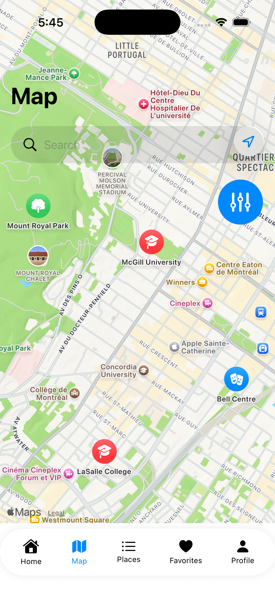

# NearBy - Location Discovery iOS App

A MapKit-based iOS application that allows users to discover, explore, and save nearby places.

## Project Information

**Course:** 420-DM6-AS - iOS App Development II  
**Team Members:**
- Chadi Faour
- Rafat-Ahmed Islam
- Melinda Tran
 
## Project Overview

NearBy is a comprehensive location discovery app that combines real-time place search with robust offline capabilities. Users can explore nearby restaurants, cafés, parks, and other points of interest, save their favorites.

## Key Features

### Core Functionality
- **Interactive Map Interface** - MapKit-based exploration with custom annotations
- **Place Discovery** - Search and filter nearby locations by category, distance, and rating
- **Offline Favorites** - Save unlimited favorites with full offline access via CoreData
- **Personal Notes** - Add custom notes to any saved place
- **User Preferences** - Customizable search radius, measurement units, and map styles
- **Firebase Authentication** - Secure user registration and login

### MapKit Integration
- Real-time user location tracking
- Custom place annotations with category-specific icons
- Directions and navigation to selected locations
- Distance calculations and radius visualization
- Map-based search within visible region

## Screenshots

### Authentication & Main Features

| Login | Register | Map View | Profile |
|-------|----------|----------|---------|
|  |  |  |  |

## Architecture

**Pattern:** MVVM (Model-View-ViewModel)

### Project Structure
```
NearBy/
├── Models/
│   ├── User.swift                    # Firebase user model
│   ├── Place.swift                   # Place model
│   └── Category.swift                # Category model
│
│
├── Services/
│   ├── AuthService.swift             # Firebase authentication
│   ├── FirebaseService.swift         # Firestore data operations
│   ├── CoreDataManager.swift         # CoreData management
│
├── Views/
│   ├── AuthGate.swift
│   ├── LoginView.swift
│   ├── RegisterView.swift
│   ├── MapView.swift
│   ├── ProfileView.swift
│   ├── SearchBarView.swift
│   └── ContentView.swift
│
└── Utilities/
    └── Validators.swift
```

## Technology Stack

### Frameworks & Tools
- **SwiftUI** - Modern declarative UI framework
- **MapKit** - Maps, annotations, directions, user location
- **CoreData** - Local persistent storage for offline functionality
- **Firebase**
  - Firestore - Cloud database for places data
  - Firebase Auth - User authentication and management
- **CoreLocation** - Location services and distance calculations
- **Combine** - Reactive data binding

### Development Tools
- Xcode 26+
- Git/GitHub for version control
- Firebase Console for backend management

## Data Architecture

### CoreData Entities

#### UserEntity
**Attributes:**
- userId (String) - Firebase Auth UID
- username (String)
- email (String)
- lastSynced (Date)

**Relationships:**
- favorites → PlaceEntity (To-Many, Nullify)
- notes → NoteEntity (To-Many, Cascade)
- preferences → UserPreferences (To-One, Cascade)

#### PlaceEntity
**Attributes:**
- id (String)
- name (String)
- address (String)
- latitude (Double)
- longitude (Double)
- rating (Double)
- phone (String)
- photoUrl (String)
- website (String)
- placeCategory (String)
- placeDescription (String)
- userNotes (String)
- isFavorite (Boolean)
- lastViewed (Date)

**Relationships:**
- category → CategoryEntity (To-One, Nullify)
- favoritedBy → UserEntity (To-Many, Nullify)
- notes → NoteEntity (To-Many, Cascade)

#### NoteEntity
**Attributes:**
- id (UUID)
- text (String)
- createdDate (Date)

**Relationships:**
- user → UserEntity (To-One, Cascade)
- place → PlaceEntity (To-One, Cascade)

#### CategoryEntity
**Attributes:**
- id (String)
- name (String)
- iconName (String)
- colorHex (String)

**Relationships:**
- places → PlaceEntity (To-Many, Nullify)

#### UserPreferences
**Attributes:**
- id (String)
- defaultRadius (Double)
- mapStyle (String)
- units (String)
- preferredCategories (Transformable)

**Relationships:**
- user → UserEntity (To-One, Nullify)

### Delete Rules Summary
- **Cascade** - Deleting owner deletes dependents (User→Notes, Place→Notes, User→Preferences)
- **Nullify** - Deleting breaks relationship without deleting related objects (Category→Places, User→Favorites)

## Getting Started

### Prerequisites
- macOS 14.0 or later
- Xcode 26 or later
- iOS 17.0+ deployment target
- Active Apple Developer account (for device testing)
- Firebase project setup

### Installation

1. **Clone the repository**
```bash
git clone https://github.com/your-repo/NearBy.git
cd NearBy
```

2. **Firebase Setup**
   - Create a Firebase project at [Firebase Console](https://console.firebase.google.com)
   - Download `GoogleService-Info.plist`
   - Add to your Xcode project root
   - Enable Firestore Database
   - Enable Firebase Authentication (Email/Password)

3. **Open in Xcode**
```bash
open NearBy.xcodeproj
```

4. **Configure Signing**
   - Select your development team
   - Update bundle identifier if needed

5. **Build and Run**
   - Select target device/simulator
   - Press `Cmd + R`

## Project Requirements Checklist

### Mandatory Requirements
- [x] **Networking** - Firebase Firestore for data retrieval and storage
- [x] **CoreData** - Persistent local storage for favorites and offline access
- [x] **MapKit** - Interactive map with annotations, user location, directions
- [x] **15+ Functional Screens** - Authentication, main tabs, detail views, settings
- [x] **MVVM Architecture** - Clear separation of concerns
- [x] **Firebase Authentication** - User registration and login
- [x] **Version Control** - Git/GitHub with frequent, meaningful commits


## Screen Count Present & Future (22 Screens)

### Authentication Flow (3)
1. Splash Screen
2. Login Screen
3. Sign Up Screen

### Main App - Tab Bar (5)
4. Home/Dashboard
5. Map View (Primary)
6. Places List
7. Favorites
8. Profile

### Detail & Interaction (14)
9. Place Details
10. Add/Edit Notes
11. Directions View
12. Search Screen
13. Filter Screen
14. Categories Grid
15. Category Places List
16. Settings
17. Edit Profile
18. Notification Settings
19. Offline Places
20. About/Help
21. User Preferences
22. Recently Viewed

## UI/UX Highlights

- **iOS Human Interface Guidelines** compliance
- **Consistent Design** - Unified color scheme and typography
- **Smooth Navigation** - Predictable flow between screens
- **Accessibility** - Dynamic Type support, sufficient contrast
- **Custom Tab Bar** - Elegant bottom navigation
- **Loading States** - Progress indicators for async operations

## Privacy & Permissions

The app requires the following permissions:

**Location Services**
- **When In Use** - For showing user location on map and calculating distances
- **Always** - Optional, for background location updates (if implemented)

Configure in `Info.plist`:
```xml
<key>NSLocationWhenInUseUsageDescription</key>
<string>NearBy uses your location to show nearby places and calculate distances</string>
```

## Testing

### Manual Testing Checklist
- [ ] User registration with valid/invalid inputs
- [ ] Login with correct/incorrect credentials
- [ ] Add place to favorites (online & offline)
- [ ] Remove place from favorites
- [ ] Create note for a place
- [ ] Search places by name
- [ ] Filter places by category
- [ ] View place details
- [ ] Get directions to place
- [ ] Update user preferences
- [ ] Logout functionality

## Dependencies

### Swift Package Manager
- Firebase iOS SDK
  - FirebaseAuth
  - FirebaseFirestore

### Frameworks (Built-in)
- SwiftUI
- MapKit
- CoreData
- CoreLocation
- Combine

## Known Issues

None at this time.

## Future Enhancements

- Dashboard View
- Place reviews and ratings
- Advanced filtering (open now, price range)
- Route planning for multiple destinations

## License

This project is part of an academic course and is for educational purposes only.

## Contributors

- **Chadi Faour**
- **Rafat-Ahmed Islam**
- **Melinda Tran**
