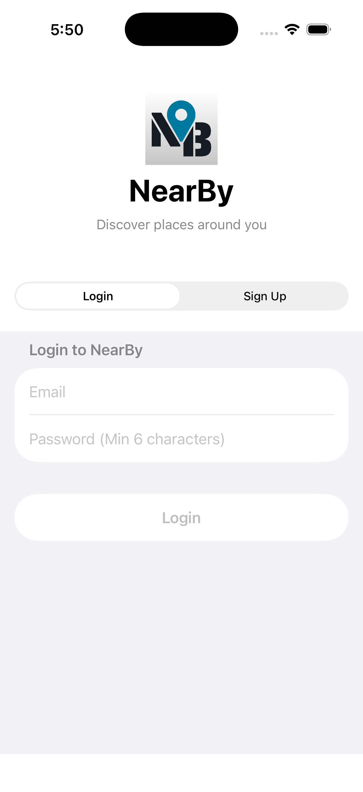
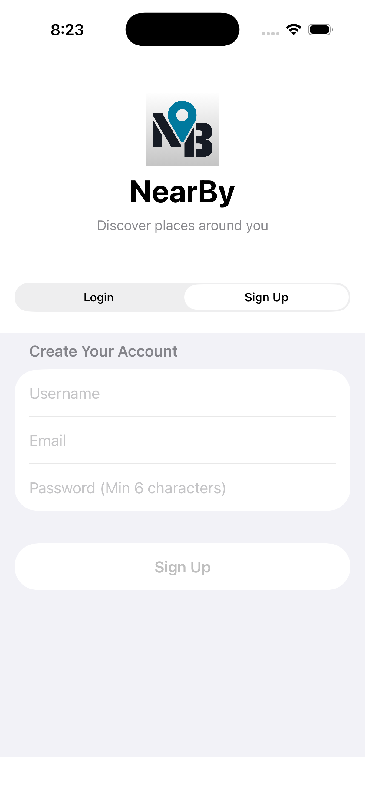
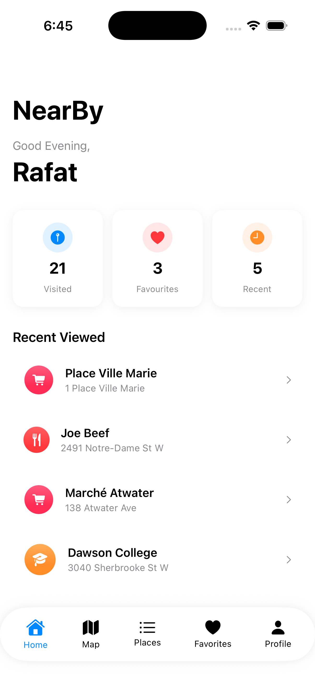
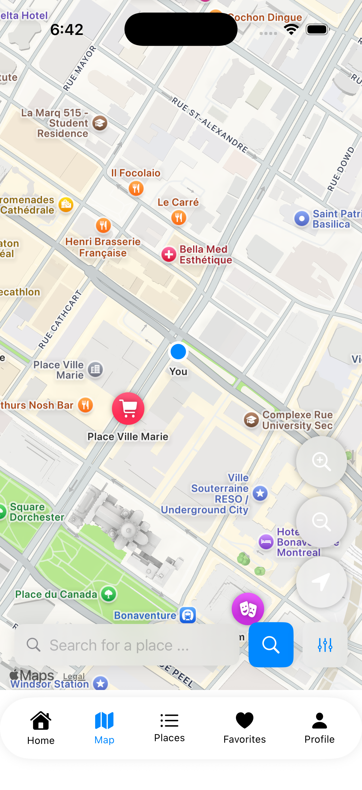
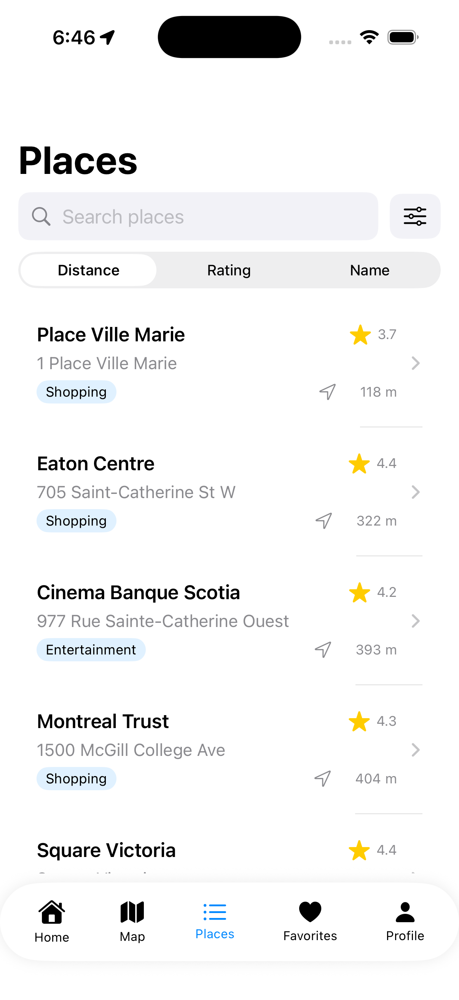
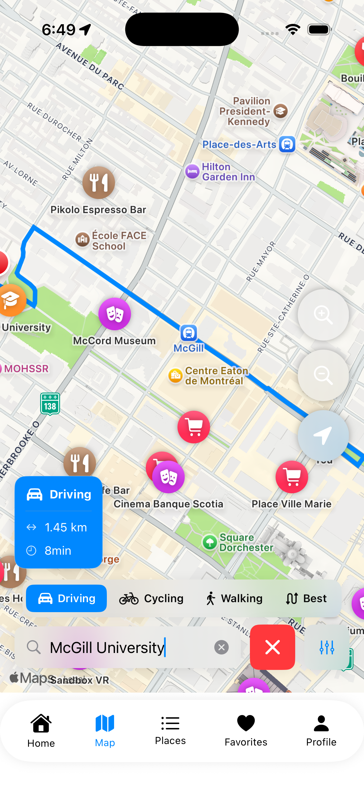
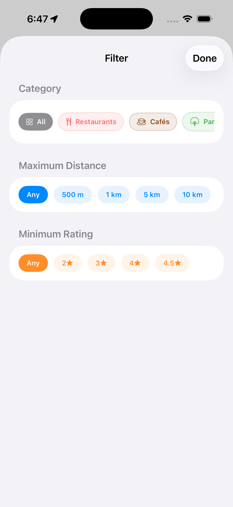
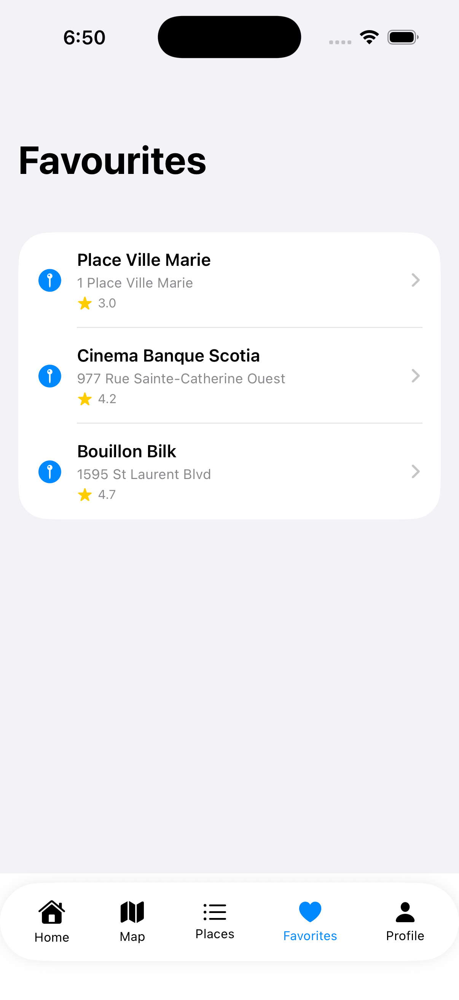
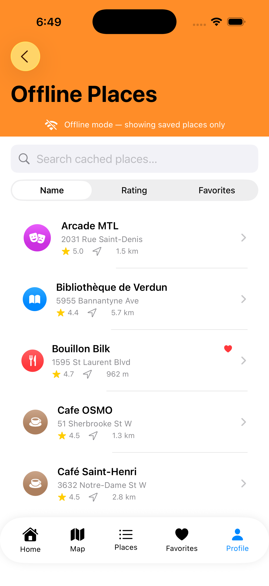
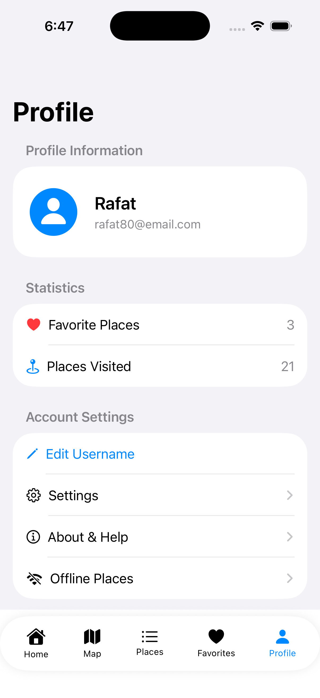

# NearBy — Location Discovery iOS App

A MapKit-based iOS application for discovering, exploring, and saving nearby places.

## Project Information

**Course:** 420-DM6-AS — iOS App Development II
**Team Members:** Chadi Faour · Rafat-Ahmed Islam · Melinda Tran

---

## Overview

NearBy is a full-featured location discovery app that combines real-time place search with offline capabilities. Users can explore nearby restaurants, cafés, parks, libraries, and other points of interest, save favourites for offline access, add personal notes, get turn-by-turn directions, and manage their profile — all built on a clean MVVM architecture.

---

## Screenshots

### Authentication

| Login | Register |
|-------|----------|
|  |  |

### Core Features

| Dashboard | Map View | Place Details | Directions |
|-----------|----------|---------------|------------|
|  |  |  |  |

### Discovery & Filtering

| Filters | Favourites | Offline View | Profile |
|---------|------------|--------------|---------|
|  |  |  |  |

---

## Features

### Map & Discovery
- Interactive MapKit interface with category-specific place annotations
- Real-time user location tracking with radius visualisation
- Combined search: Firebase places + MKLocalSearchCompleter autocomplete
- Directions with 4 transport modes (Driving, Cycling, Walking, Best) and live route polyline
- Filter by category, distance, and rating

### Offline & Data
- Unlimited favorites stored in CoreData with full offline access
- Recently viewed cache (last 50 places)
- NetworkMonitor detects connectivity and switches to cached data automatically
- Personal notes on any saved place, persisted locally

### User & Settings
- Firebase Authentication (register / login / logout)
- Profile with visit count and favourites count
- Customisable search radius, map style (Standard / Satellite / Hybrid), and distance units
- User preferences persisted in CoreData

---

## Architecture

**Pattern:** MVVM (Model-View-ViewModel)

```
NearBy/
├── Models/
│   ├── Place.swift                     # Place model
│   ├── User.swift                      # Firebase user model
│   ├── Category.swift                  # Category model
│   └── MapFilter.swift                 # Filter state model
│
│
├── Services/
│   ├── AuthService.swift               # Firebase Authentication
│   ├── FirebaseService.swift           # Firestore CRUD
│   ├── CoreDataManager.swift           # CoreData stack
│   ├── PlaceFirebaseSync.swift         # Firebase <--> CoreData sync
│   ├── PlaceSyncCoordinator.swift      # Sync orchestration
│   └── UserSettingsStore.swift         # User preferences store
│
├── Views/
│   ├── AuthGate.swift                  # Auth routing
│   ├── LoginView.swift
│   ├── RegisterView.swift
│   ├── OnboardingView.swift
│   ├── DashView.swift                  # Home / Dashboard
│   ├── MapView.swift                   # Primary map screen
│   ├── PlacesListView.swift
│   ├── PlaceDetailsView.swift          # Includes NoteEditorView, RatingEditorView
│   ├── FavouritesViews.swift
│   ├── ProfileView.swift               # Includes EditUsernameView
│   ├── SettingsView.swift
│   ├── FilterView.swift
│   ├── CategoriesView.swift
│   ├── CategoryPlacesListView.swift
│   ├── OfflinePlacesView.swift
│   └── AboutView.swift
│
└── Utilities/
    ├── LocationManager.swift           # CoreLocation wrapper
    ├── NetworkMonitor.swift            # Connectivity detection
    ├── TimeFormatter.swift
```

---

## Technology Stack

| Framework | Purpose |
|-----------|---------|
| SwiftUI | Declarative UI across all screens |
| MapKit | Map display, annotations, routing, MKLocalSearch |
| CoreData | Local persistence - favourites, notes, cache, preferences |
| Firebase Firestore | Cloud database for places, users, categories |
| Firebase Auth | User registration and login |
| CoreLocation | Live location and distance calculations |
| Combine | Reactive `@Published` bindings throughout MVVM |

**Tools:** Xcode 26 · Git / GitHub · Firebase

---

## CoreData Model

5 entities with proper relationships and delete rules:

| Entity | Key Attributes | Relationships |
|--------|---------------|---------------|
| `UserEntity` | userId, username, email, lastSynced | favorites (→Place, Nullify), notes (-->Note, Cascade), preferences (-->Prefs, Cascade) |
| `PlaceEntity` | id, name, address, lat/lng, rating, isFavorite, lastViewed, userNotes | category (-->Category, Nullify), favoritedBy (-->User, Nullify), notes (→Note, Cascade) |
| `NoteEntity` | id (UUID), text, createdDate | user (→User, Cascade), place (-->Place, Cascade) |
| `CategoryEntity` | id, name, iconName, colorHex | places (-->Place, Nullify) |
| `UserPreferences` | defaultRadius, mapStyle, units, preferredCategories | user (-->User, Nullify) |

---

## Screens (20 functional screens)

### Authentication (3)
1. Splash Screen
2. Login
3. Register

### Onboarding (1)
4. Onboarding (3-step: welcome --> features --> location permission)

### Main Tab Bar (5)
5. Dashboard / Home
6. Map View  (primary screen)
7. Places List
8. Favorites
9. Profile

### Detail & Interaction (11)
10. Place Details
11. Note Editor (sheet)
12. Rating Editor (sheet)
13. Directions (inline in Map View)
14. Filter Screen
15. Categories Grid
16. Category Places List
17. Settings
18. Edit Username (sheet)
19. Offline Places
20. About / Help

---

## Getting Started

### Prerequisites
- Xcode 26+
- iOS 26+
- Firebase

### Installation

1. **Clone the repository**
```bash
git clone https://github.com/Rafat-i/NearBy.git
cd NearBy
```

2. **Firebase setup**
   - Create a project at [Firebase Console](https://console.firebase.google.com)
   - Enable Firestore Database and Authentication (Email/Password)
   - Download `GoogleService-Info.plist` and add it to the Xcode project root

3. **Open and run**
```bash
open NearBy.xcodeproj
```
   - Select your development team under Signing & Capabilities
   - Press `Cmd + R`

## Dependencies

**Swift Package Manager**
- `firebase-ios-sdk` — FirebaseAuth, FirebaseFirestore

**Built-in frameworks**
- SwiftUI · MapKit · CoreData · CoreLocation · Combine

---

## Contributors

**Chadi Faour** · **Rafat-Ahmed Islam** · **Melinda Tran**
